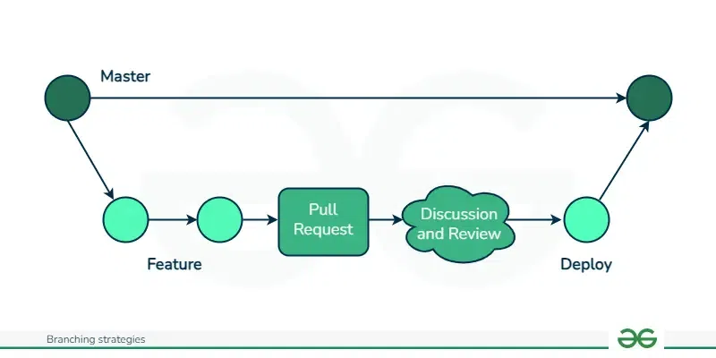

# Intro zur Git-Versionierung
**Git und Github**
- Was ist Git?
  - Git ist ein verteiltes Versionskontrollsystem.
  - Es hilft, Änderungen im Code zu verfolgen und die Zusammenarbeit zu erleichtern.
- Was ist GitHub?
  - Eine cloudbasierte Plattform zur Verwaltung von Git-Repositories.
  - Bietet Kollaborationswerkzeuge wie Pull Requests und Issues.
- Warum Git und GitHub verwenden?
  - Verfolgt Änderungen effizient.
  - Erleichtert die Teamarbeit.
  - Ermöglicht das Zurücksetzen auf frühere Versionen.
  - Unterstützt die Zusammenarbeit über das Internet.

**Wichtige Begriffe**
- Repository (Repo): Speicherort für ein Projekt.
- Commit: Eine gespeicherte Änderung.
- Branch: Ein separater Entwicklungszweig.
- Merge: Das Zusammenführen von Änderungen aus verschiedenen Branches.
- Remote: Eine Online-Version eines Repositories (z. B. GitHub, GitLab).
- Clone: Eine Kopie eines Repositories.
- Pull: Abrufen der neuesten Änderungen aus einem Remote-Repository.
- Push: Hochladen von Änderungen in ein Remote-Repository.
- Fork: Eine Kopie eines Repositories eines anderen Benutzers.
- Pull Request (PR): Eine Anfrage, um Änderungen in den Hauptbranch zu übernehmen.
- Issue: Eine Möglichkeit, Fehler zu melden oder neue Funktionen anzufordern.

**Prozess**


**Git und GitHub einrichten**
- Git installieren:
  - Windows: Download von [git-scm.com](https://git-scm.com/).
  - macOS: Installation über Homebrew (`brew install git`).
  - Linux: Installation über Paketmanager (`sudo apt install git`).
- Git konfigurieren:
  ```bash
  git config --global user.name "deine Name"
  git config --global user.email "dein.email@example.com"
  ```
- GitHub-Konto erstellen unter [github.com](https://github.com/).
- [Semantic PR](shttps://github.com/apps/semantic-prs) (eine GitHub-Anwendung, die sicherstellt, dass Pull Requests dem Conventional Commits-Standard entsprechen) installieren.

**Ein Repository erstellen**
- Neues Repository initialisieren:
  ```bash
  git init --initial-branch=main
  ```
- Ein bestehendes Repository klonen:
  ```bash
  git clone <repository_url>
  ```
- Neues Repository auf GitHub erstellen:
  - Auf GitHub gehen und "New Repository" klicken.
  - Eine README-Datei hinzufügen.

**Änderungen vornehmen und speichern**
- Status der Änderungen überprüfen:
  ```bash
  git status
  ```
- Dateien zum Staging-Bereich hinzufügen:
  ```bash
  git add <datei>
  ```
- Änderungen committen:
  ```bash
  git commit -m "Dein Commit-Nachricht"
  ```
- Commit-Historie zeigen:
  ```bash
  git log
  ```

**Arbeiten mit Branches**
- Neuen Branch erstellen:
  ```bash
  git branch <branch_name>
  ```
- Zu einem Branch wechseln:
  ```bash
  git checkout <branch_name>
  ```
- Branches zusammenführen:
  ```bash
  git merge <branch_name>
  ```

**Zusammenarbeit mit Git und GitHub**
- Ein Remote-Repository hinzufügen:
  ```bash
  git remote add origin <repository_url>
  ```
- Änderungen in ein Remote-Repository pushen:
  ```bash
  git push origin <branch_name>
  ```
**WICHTIG:** Keine Kundendaten auf GitHub!

- Neueste Änderungen abrufen:
  ```bash
  git pull origin <branch_name>
  ```
- Ein Issue öffnen, um Fehler zu melden oder Features anzufordern.
- Einen Pull Request (PR) öffnen, um Änderungen vorzuschlagen.


**Konflikte lösen**
- Merge-Konflikte entstehen, wenn zwei Personen denselben Teil einer Datei ändern.
- Git markiert die Konfliktbereiche.
- Die Datei manuell bearbeiten, um den Konflikt zu lösen.
- Die gelöste Datei hinzufügen und committen:
  ```bash
  git add <datei>
  git commit -m "Merge-Konflikt gelöst"
  ```

**Ressourcen**
  - [Git-Dokumentation](https://git-scm.com/doc)
  - [GitHub Dokumentation](https://docs.github.com/de)

